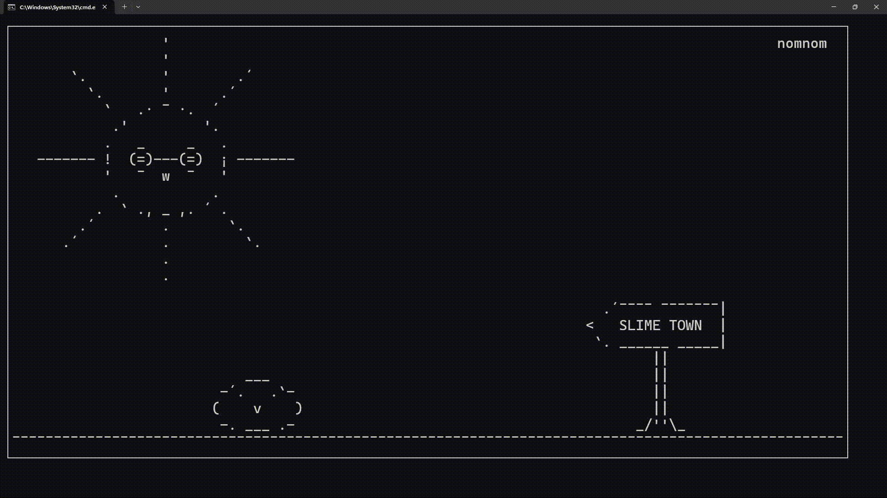

# tgi-game-engine

Terminal Graphics Integrated Game Engine was a passion project of mine from Feb 2024.

I don't intend to continue working on this or document any of it, and it is a mess because I was not much exprienced with oop concepts (even though it is written in python), and abstract design just after the first semester of the computer engineering. But I uploaded "slime_animation" and "walking_around" demos if you want see how it works, and test it. Here is some things that I created with the so-called engine:

